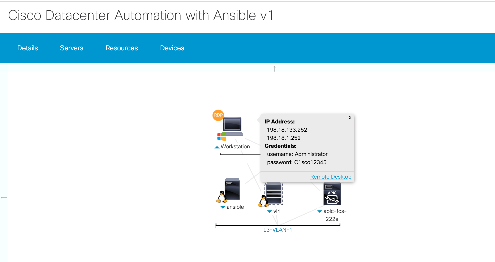
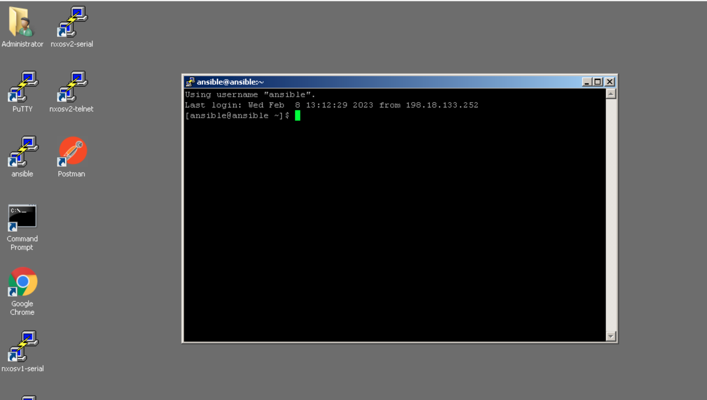
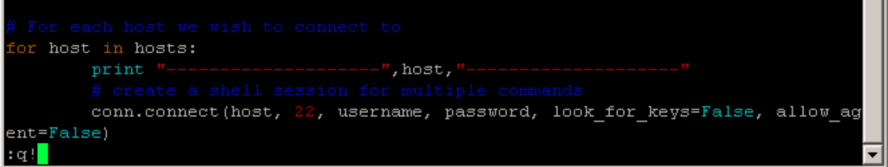
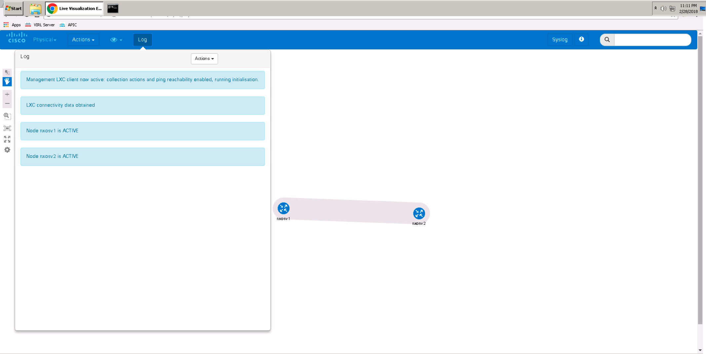

# Welcome to Cisco Datacenter NXOS Automation with Ansible

## About This Lab

This document is for the preconfigured Cisco Data Center NXOS Automation with Ansible includes:

* About This Lab
* Requirements
* About The Lab Exercises
* Topology
* Get Started
* NXOS Automation
   * Lab 1. Automation using Python
   		* AutomatedCLI
   		* AutomatedNXAPI  
	* Lab 2. Ansible Fundamentals  
   * Lab 3. Basic Ansible
   		* 3.1 Loops
   		* 3.2Conditionals
   		* 3.3Templates
   * Lab 4. Advanced Ansible
   		* 4.1Groups
   		* 4.2Roles
   * Troubleshooting

    
## Requirements

* Login to Cisco dCloud
* Laptop
* Cisco AnyConnect (Optional)

## Components
* Cisco VIRL
* NXOSv 7.0 (3) I7(1)
* Ansible host - CentOS 7
* PC Workstation at 198.18.133.252:
	* Includes PuTTY with shortcut for Ansible host, NXOSv1, and NXOSv2
	* Chrome with tabs open for Launch Control Center and Live Visualization Engine

## Features
### Cisco VIRL
* Virtual environment for building network topologies
* Simulation of networking components
* Capable of running a range of virtual machines (VMs) running Cisco operating systems (IOS-XE, IOS Classic, IOS-XR, and NX-OS)
* Support for third-party VMs
* Capture and analyze network traffic at any node
* Validate configurations prior to physical deployment

### NXOS
* NXOS is open and modular
* NX-OS supports built-in DevOps automation tools like Puppet, Chef, and Ansible, and native and industry standard YANG models
* NXOS application hosting supports third-party off-the-shelf applications
* Programmable NXOS enables integration with orchestration tools


## About these Lab Exercises

This document provides a step-by-step guide to learning how to automate Cisco NXOS using the Open Source Ansible automation technology [Ansible](http://ansible.com). It uses virtualised instances of Linux and NXOS in order to provide an environment for lab task execution and experimentation.

Ansible enables the simple automation of tasks across different parts of the infrastructure including compute, storage, and networking. When operating on Cisco NXOS devices Ansible uses the NXAPI, in contrast to its general server operations where it will execute Python code locally on the device under management. This centralized model of operation appeals to large-scale network operators and is one reason for Ansible’s popularity in the Service Provider industry.

In the exercises you will be configuring two virtual NXOS devices – nxosv1 and nxosv2. For our scenarios, we consider nxosv1 a devtest device, and nxosv2 a production device. This will help us in highlighting numerous advanced capabilities of Ansible. Through the NXOS lab exercises, we will configure and manipulate numerous private and public VLANs, IP interfaces, IP route tables, and VRFs. In ACI, we will configure tenants, bridge domains, VRFs, Contracts, Endpoint Groups and Application Profiles.

You will begin with simple configuration of the devtest device, using basic VLANs and IP interfaces. This allows us to introduce the fundamental features and structure of Ansible with use cases which most networking professionals would be familiar with.


In later NXOS lab exercises we highlight ways in which we can build on common configurations to customise and extend for specific network infrastructure roles. For example, on the production devices you can add the following for better security.

* Create VRFs namely Web, App, DB and stitch them using FW and Load balancers.
* Create IP Access List for Web VLAN
* Create required static routes to ensure traffic goes through a firewall and load balancer.
* To ensure security within each VRF we will use private VLANs.


> NOTE: We’ll be configuring only the devtest device, nxosv1 in the first 3 lab exercises. We’ll use the advanced concepts of Ansible, to configure both devtest (nxosv1) and production (nxosv2) devices in lab 4.


## Topology


**Windows Workstation:** A Windows VM which has connectivity to the rest of the components in this lab. All the components/devices in the lab are in a private network and can only be accessed through this windows workstation. Users can access the windows workstation through RDP.

**VIRL:** Cisco’s Virtual Internet Routing Lab [VIRL](http://virl.cisco.com/) is a network virtualization and orchestration platform. We’ll be simulating the required NXOS lab topologies on VIRL. VM Maestro is the frontend software which is used for creating simulation topologies and running them.


**Ansible VM:** A Centos VM where the users will execute all the lab exercises. This VM has connectivity to the VIRL devices and ACI Simulator. Ansible, Python and all the required packages have been installed in this VM. Users can access the Ansible VM through SSH using Putty on the windows workstation.

## How to connect to lab

Step 1: Once the session has been opened, You have two options to connect to the lab: **VPN and Remote Desktop (Without connecting to VPN) **

**Option1 VPN:** select Details and then use Anyconnect to connect to the lab using the specified host url, login, and password.


 **Option2 Remote Desktop(without VPN):**  click on **wkst1** icon and then click on the **Remote Desktop**. Another tab will be opened for the workstation. The workstation is where you will be performing the lab. 



## Using VI editor

In the lab exercises, you will be asked to edit existing scripts in the ansible host. In order to do this, you can use the VI editor tool available. Below are the instructions for using a VI editor to edit the scripts. Please, refer to this section when you need to work with the scripts in the lab exercises.

Minimize the Chrome Web browser, and double-click the ansible terminal icon. This opens a Linux shell session as shown below.



**Open a script:** In the ansible host putty terminal, enter the command as below to open a script in VI editor.

```
[ansible@ansible ~]$ vi <enter path to the script here>
```
**Example:** 

```
[ansible@ansible ~]$ vi dc-automation-bootcamp/nxos/lab1/cli/enable_feature_cli.py
```
The VI editor window opens up with the script. You can scroll through the script using up/down arrow keys or page up/page down keys.


**Edit a script:** Open the script you wish to edit. Once open, enter the edit mode by pressing the key ‘i’ on your keyboard. Navigate to the line you want to edit and make the changes. To exit the edit mode, press ‘Esc’ key.

**Save changes:** Once you are done editing, exit the edit mode by pressing the ‘Esc’ key. Then type ‘:wq!’ and hit Enter to save changes.


**Undo changes:** If you wish to undo changes you just made to the script, exit the edit mode by pressing the ‘Esc’ key. Press the key ‘u’ on your keyboard to undo the last change.

**Exit the script:** Once you exit the edit mode by pressing the ‘Esc’ key, type ‘:q’ and hit Enter to exit the script. If you have unsaved
changes, save the changes before exiting the script. If you want to exit discarding the changes, type ‘:q!’ and press Enter to exit.



## Troubleshooting

In case of any problems with the VIRL instances, please use the web tools available in Chrome on the Windows remote desktop.

The first tab provides control over the VIRL simulation. You can start, stop or reset the simulation.

In case you need to reset the entire simulation i.e., both the NXOSv devices, it is recommended to use the ‘Reset my button on this tab.


> Note: The demo will automatically start after you reset it. You don’t need to use the start button.

In the second tab, a live visualization tool is available for debugging any issues within the topology. If there’s an active simulation, you should see the simulation ID in the drop-down list as shown in the below screenshot. Select the simulation and click on **Submit**.


Click on the ‘Log’ button to see log entries related to the simulation status. If the nxosv1 node status is ACTIVE, it means that the simulation is active but the devices are not reachable yet.

Clicking on the device icon provides you with few options which are useful for connecting to that particular device.

If there is an issue with one of the devices or you want to reset a device, shutdown the device by clicking on the Shutdown Node option that is available when you click on the device.




When the devices are shutdown, the status in the logs will show as ABSENT.

When the NXOSv nodes are restarted, they take approximately 5-10 minutes to boot up and become reachable. You can monitor each device booting up by connecting to the serial0 through telnet. To do this, click on the device in the topology and click on Telnet to serial0. A new chrome window will pop up with a telnet session to the device. Once you see the login prompt to the device as in the screenshot below, the device is reachable.


The status in the Log changes to REACHABLE when the devices have booted up and become reachable.


## NXOS Automation


> **Value Proposition:** This scenario aims to show how NXOS can be configured with varying degrees of automation and reliability. dCloud: The Cisco Demo Cloud
We start off by automating NXOS using python scripts and later on we explore Ansible. Ansible enables the simple automation f tasks across different parts of the infrastructure including compute, storage, and networking. Through the four lab exercises available in this scenario, users will learn how to use Ansible with NXOS, starting with basic concepts and then moving towards advanced concepts of Ansible.

### Lab 1. Automation using Python

This exercise aims to show participants how network infrastructure can be configured with varying degrees of automation and reliability. Participants should understand the automation options available in order to compare the degree of manual effort
required, the reliability of each method, and how each example supports seamless, scalable, network operations.


Many network operators automate configuration using Shell or Python scripts. We can use the following Python example to (blindly) attempt injection of CLI commands to the network devices. NXOS provides both Unix shell and a Python interpreter which
enables you to script and automate the operation of a switch using local programmatic capabilities. Cisco Nexus switches have Python 2.7.5 installed and can be used for programmatic access to the switch CLI to perform various tasks.

### Automated CLI

1. From the remote workstation desktop, launch putty shortcut to ‘ansible’ host.


