# Welcome to Cisco Datacenter NXOS Automation with Ansible

## About This Lab

This document provides a step-by-step guide to learning how to automate Cisco NXOS using the Open Source Ansible automation technology [Ansible](http://ansible.com). It uses virtualised instances of Linux and NXOS in order to provide an environment for lab task execution and experimentation.

This guide is for the preconfigured Cisco Data Center NXOS Automation with Ansible includes:

* [Requirements](#Requirements)
* [About The Lab Exercises](#About The Lab Exercises)
* Topology
* Get Started
* NXOS Automation
   * Lab 1. Automation using Python
   		* AutomatedCLI
   		* AutomatedNXAPI  
	* Lab 2. Ansible Fundamentals  
   * Lab 3. Basic Ansible
   		* 3.1 Loops
   		* 3.2Conditionals
   		* 3.3Templates
   * Lab 4. Advanced Ansible
   		* 4.1Groups
   		* 4.2Roles
   * Troubleshooting

    
## Requirements

* Login to Cisco dCloud
* Laptop
* Cisco AnyConnect (Optional)

## Components
* Cisco VIRL
* NXOSv 7.0 (3) I7(1)
* Ansible host - CentOS 7
* PC Workstation at 198.18.133.252:
	* Includes PuTTY with shortcut for Ansible host, NXOSv1, and NXOSv2
	* Chrome with tabs open for Launch Control Center and Live Visualization Engine

## Features
### Cisco VIRL
* Virtual environment for building network topologies
* Simulation of networking components
* Capable of running a range of virtual machines (VMs) running Cisco operating systems (IOS-XE, IOS Classic, IOS-XR, and NX-OS)
* Support for third-party VMs
* Capture and analyze network traffic at any node
* Validate configurations prior to physical deployment

### NXOS
* NXOS is open and modular
* NX-OS supports built-in DevOps automation tools like Puppet, Chef, and Ansible, and native and industry standard YANG models
* NXOS application hosting supports third-party off-the-shelf applications
* Programmable NXOS enables integration with orchestration tools


## About these Lab Exercises


Ansible enables the simple automation of tasks across different parts of the infrastructure including compute, storage, and networking. When operating on Cisco NXOS devices Ansible uses the NXAPI, in contrast to its general server operations where it will execute Python code locally on the device under management. This centralized model of operation appeals to large-scale network operators and is one reason for Ansible’s popularity in the Service Provider industry.

In the exercises you will be configuring two virtual NXOS devices – nxosv1 and nxosv2. For our scenarios, we consider nxosv1 a devtest device, and nxosv2 a production device. This will help us in highlighting numerous advanced capabilities of Ansible. Through the NXOS lab exercises, we will configure and manipulate numerous private and public VLANs, IP interfaces, IP route tables, and VRFs. In ACI, we will configure tenants, bridge domains, VRFs, Contracts, Endpoint Groups and Application Profiles.

You will begin with simple configuration of the devtest device, using basic VLANs and IP interfaces. This allows us to introduce the fundamental features and structure of Ansible with use cases which most networking professionals would be familiar with.


In later NXOS lab exercises we highlight ways in which we can build on common configurations to customise and extend for specific network infrastructure roles. For example, on the production devices you can add the following for better security.

* Create VRFs namely Web, App, DB and stitch them using FW and Load balancers.
* Create IP Access List for Web VLAN
* Create required static routes to ensure traffic goes through a firewall and load balancer.
* To ensure security within each VRF we will use private VLANs.


> NOTE: We’ll be configuring only the devtest device, nxosv1 in the first 3 lab exercises. We’ll use the advanced concepts of Ansible, to configure both devtest (nxosv1) and production (nxosv2) devices in lab 4.


## Topology

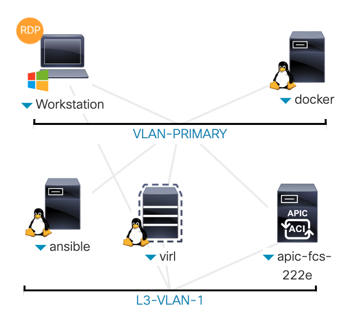

**Windows Workstation:** A Windows VM which has connectivity to the rest of the components in this lab. All the components/devices in the lab are in a private network and can only be accessed through this windows workstation. Users can access the windows workstation through RDP.

**VIRL:** Cisco’s Virtual Internet Routing Lab [VIRL](http://virl.cisco.com/) is a network virtualization and orchestration platform. We’ll be simulating the required NXOS lab topologies on VIRL. VM Maestro is the frontend software which is used for creating simulation topologies and running them.


**Ansible VM:** A Centos VM where the users will execute all the lab exercises. This VM has connectivity to the VIRL devices and ACI Simulator. Ansible, Python and all the required packages have been installed in this VM. Users can access the Ansible VM through SSH using Putty on the windows workstation.

## How to connect to lab

Step 1: Once the session has been opened, You have two options to connect to the lab: 

**1) VPN**

**2) Remote Desktop (Without connecting to VPN)**

**Option1 VPN:** select Details and then use Anyconnect to connect to the lab using the specified host url, login, and password.

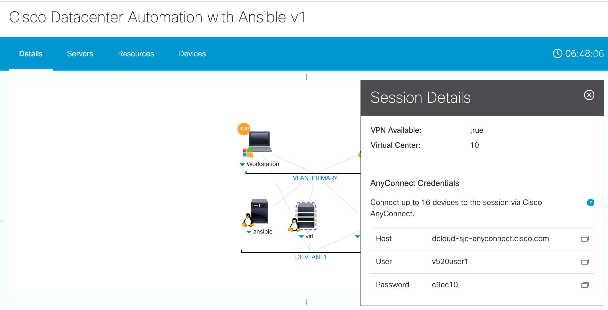

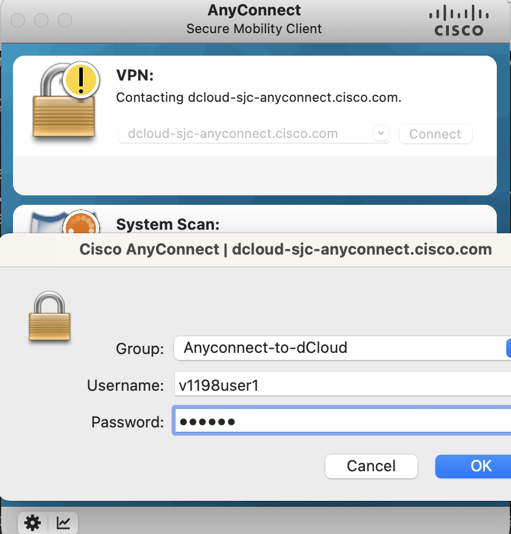

 **Option2 Remote Desktop(without VPN):**  click on **wkst1** icon and then click on the **Remote Desktop**. Another tab will be opened for the workstation. The workstation is where you will be performing the lab. 


## Using VI editor

In the lab exercises, you will be asked to edit existing scripts in the ansible host. In order to do this, you can use the VI editor tool available. Below are the instructions for using a VI editor to edit the scripts. Please, refer to this section when you need to work with the scripts in the lab exercises.

Minimize the Chrome Web browser, and double-click the ansible terminal icon. This opens a Linux shell session as shown below.


**Open a script:** In the ansible host putty terminal, enter the command as below to open a script in VI editor.

```
[ansible@ansible ~]$ vi <enter path to the script here>
```
**Example:** 

```
[ansible@ansible ~]$ vi dc-automation-bootcamp/nxos/lab1/cli/enable_feature_cli.py
```
The VI editor window opens up with the script. You can scroll through the script using up/down arrow keys or page up/page down keys.
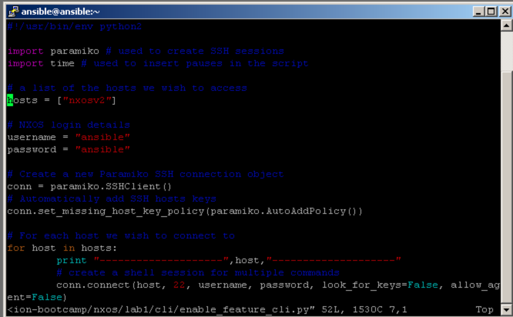

**Edit a script:** Open the script you wish to edit. Once open, enter the edit mode by pressing the key ‘i’ on your keyboard. Navigate to the line you want to edit and make the changes. To exit the edit mode, press ‘Esc’ key.

**Save changes:** Once you are done editing, exit the edit mode by pressing the ‘Esc’ key. Then type ‘:wq!’ and hit Enter to save changes.

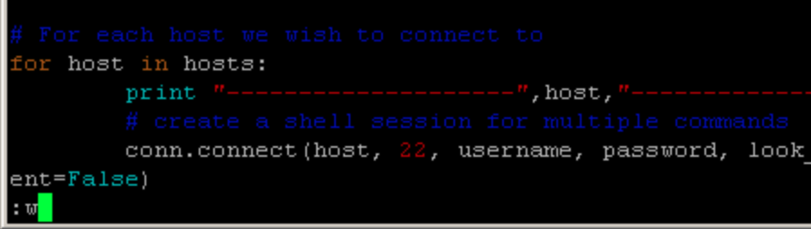

**Undo changes:** If you wish to undo changes you just made to the script, exit the edit mode by pressing the ‘Esc’ key. Press the key ‘u’ on your keyboard to undo the last change.

**Exit the script:** Once you exit the edit mode by pressing the ‘Esc’ key, type ‘:q’ and hit Enter to exit the script. If you have unsaved
changes, save the changes before exiting the script. If you want to exit discarding the changes, type ‘:q!’ and press Enter to exit.


## Troubleshooting

In case of any problems with the VIRL instances, please use the web tools available in Chrome on the Windows remote desktop.

The first tab provides control over the VIRL simulation. You can start, stop or reset the simulation.

In case you need to reset the entire simulation i.e., both the NXOSv devices, it is recommended to use the ‘Reset my button on this tab.

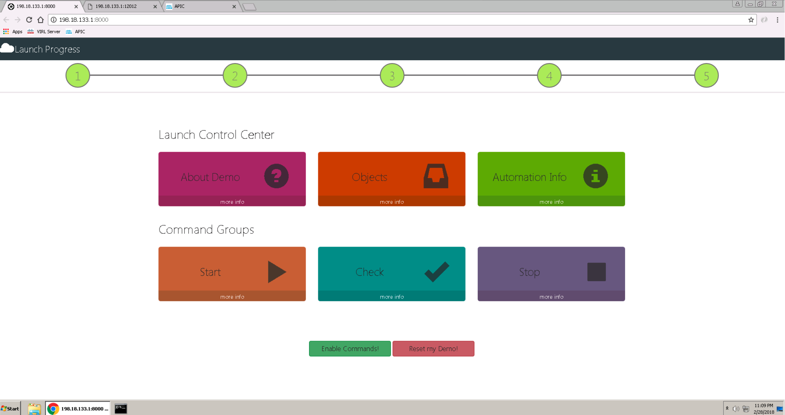

> Note: The demo will automatically start after you reset it. You don’t need to use the start button.

In the second tab, a live visualization tool is available for debugging any issues within the topology. If there’s an active simulation, you should see the simulation ID in the drop-down list as shown in the below screenshot. Select the simulation and click on **Submit**.

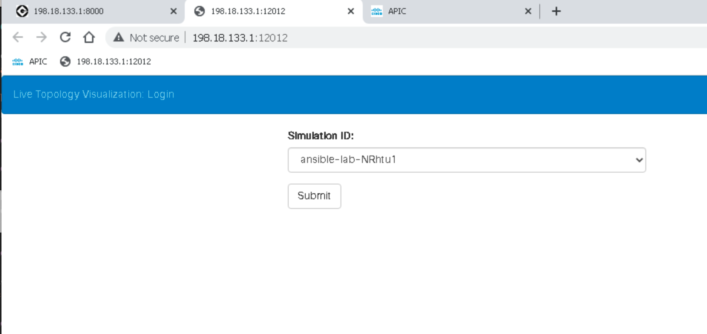

Click on the ‘Log’ button to see log entries related to the simulation status. If the nxosv1 node status is ACTIVE, it means that the simulation is active but the devices are not reachable yet.

Clicking on the device icon provides you with few options which are useful for connecting to that particular device.

If there is an issue with one of the devices or you want to reset a device, shutdown the device by clicking on the Shutdown Node option that is available when you click on the device.

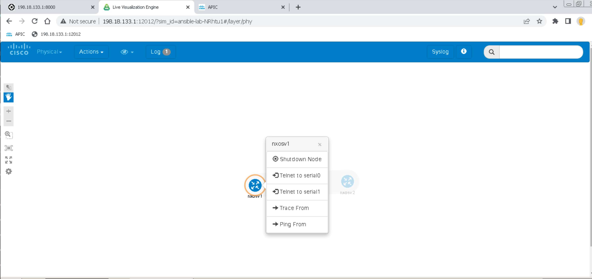


When the devices are shutdown, the status in the logs will show as ABSENT.

When the NXOSv nodes are restarted, they take approximately 5-10 minutes to boot up and become reachable. You can monitor each device booting up by connecting to the serial0 through telnet. To do this, click on the device in the topology and click on Telnet to serial0. A new chrome window will pop up with a telnet session to the device. Once you see the login prompt to the device as in the screenshot below, the device is reachable.

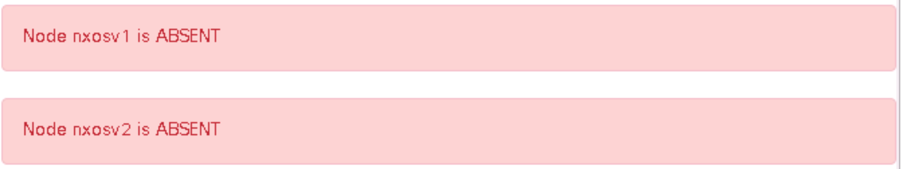

The status in the Log changes to REACHABLE when the devices have booted up and become reachable.
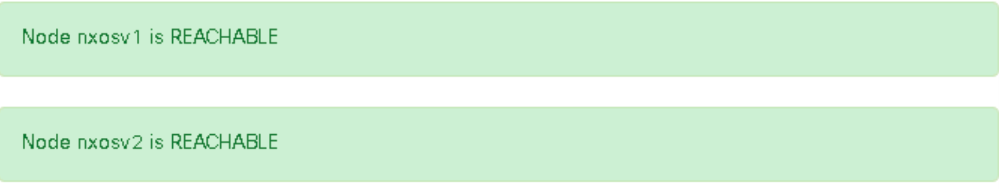


## NXOS Automation


> **Value Proposition:** This scenario aims to show how NXOS can be configured with varying degrees of automation and reliability. dCloud: The Cisco Demo Cloud
We start off by automating NXOS using python scripts and later on we explore Ansible. Ansible enables the simple automation f tasks across different parts of the infrastructure including compute, storage, and networking. Through the four lab exercises available in this scenario, users will learn how to use Ansible with NXOS, starting with basic concepts and then moving towards advanced concepts of Ansible.

### Lab 1. Automation using Python

This exercise aims to show participants how network infrastructure can be configured with varying degrees of automation and reliability. Participants should understand the automation options available in order to compare the degree of manual effort
required, the reliability of each method, and how each example supports seamless, scalable, network operations.


Many network operators automate configuration using Shell or Python scripts. We can use the following Python example to (blindly) attempt injection of CLI commands to the network devices. NXOS provides both Unix shell and a Python interpreter which
enables you to script and automate the operation of a switch using local programmatic capabilities. Cisco Nexus switches have Python 2.7.5 installed and can be used for programmatic access to the switch CLI to perform various tasks.

### Automated CLI

Step1: From the remote workstation desktop, launch putty shortcut to ‘ansible’ host.


Step2: We can use the following Python script to (blindly) attempt injection of CLI commands to the network devices. Enter the following command in the ansible putty terminal to view or edit the Python script in VI editor:

```
[ansible@ansible ~]$ vi dc-automation-bootcamp/nxos/lab1/cli/enable_feature_cli.py
```

The comments in the script explain what each command does. Go through the script to understand how it works.

```
#!/usr/bin/env python2

import paramiko # used to create SSH sessions
import time # used to insert pauses in the script

# a list of the hosts we wish to access
hosts = ["nxosv1"]

# NXOS login details
username = "ansible"
password = "ansible"

# Create a new Paramiko SSH connection object
conn = paramiko.SSHClient()
# Automatically add SSH hosts keys
conn.set_missing_host_key_policy(paramiko.AutoAddPolicy())

# For each host we wish to connect to
for host in hosts:
        print "--------------------",host,"--------------------"
        # create a shell session for multiple commands
        conn.connect(host, 22, username, password, look_for_keys=False, allow_agent=False)
        remote_shell = conn.invoke_shell()
        time.sleep(2)
        # receive remote host shell output
        output = remote_shell.recv(65535)
        # display the output
        print output

        # send the command "configure terminal"
        remote_shell.send("configure terminal\n")
        time.sleep(1)
        output = remote_shell.recv(65535)
        print output

        # Enable feature NXAPI
        remote_shell.send("feature nxapi\n")
        time.sleep(1)
        output = remote_shell.recv(65535)
        print output

        # exit the configuration mode
        remote_shell.send("end\n")
        time.sleep(1)
        output = remote_shell.recv(65535)
        print output
        time.sleep(1)

        # close the SSH session to this host we can re-use the object for the
        # next host
        conn.close()
```
Step3: Once you have gone through the script, exit the VI editor.

Step4: Run the lab exercise by entering the below command in the putty terminal.


```
[ansible@ansible ~]$ python dc-automation-bootcamp/nxos/lab1/cli/enable_feature_cli.py
```

Step5: After running, your terminal should look like this:

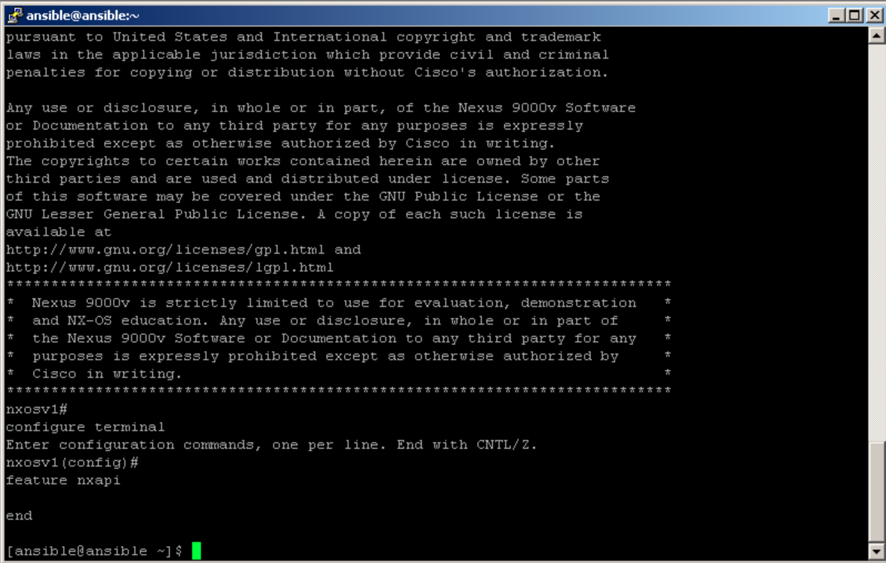

### Output

```
[ansible@ansible ~]$ python dc-automation-bootcamp/nxos/lab1/cli/enable_feature_cli.py -------------------- nxosv1 --------------------
Cisco NX-OS Software
Copyright (c) 2002-2017, Cisco Systems, Inc. All rights reserved. NX-OSv9K software ("NX-OSv9K Software") and related documentation, files or other reference materials ("Documentation") are
the proprietary property and confidential information of Cisco Systems, Inc. ("Cisco") and are protected, without limitation, pursuant to United States and International copyright and trademark laws in the applicable jurisdiction which provide civil and criminal penalties for copying or distribution without Cisco's authorization.
Any use or disclosure, in whole or in part, of the NX-OSv9K Software or Documentation to any third party for any purposes is expressly prohibited except as otherwise authorized by Cisco in writing.
The copyrights to certain works contained herein are owned by other third parties and are used and distributed under license. Some parts
of this software may be covered under the GNU Public License or the
GNU Lesser General Public License. A copy of each such license is available at
http://www.gnu.org/licenses/gpl.html and http://www.gnu.org/licenses/lgpl.html *************************************************************************** * NX-OSv9K is strictly limited to use for evaluation, demonstration * * and NX-OS education. Any use or disclosure, in whole or in part of * * the NX-OSv9K Software or Documentation to any third party for any * * purposes is expressly prohibited except as otherwise authorized by * * Cisco in writing. * ***************************************************************************
nxosv1#
configure terminal
Enter configuration commands, one per line. End with CNTL/Z. nxosv1(config)#
feature nxapi
end

```

Step6: In the Python source file, add a block of code to show the status of the NXAPI feature. Open the script in the VI editor (refer to step 2) and add the block of code highlighted in red below. Save changes and exit the VI editor.

```
        # Enable feature NXAPI 
        remote_shell.send("feature nxapi\n") 
        time.sleep(1)
        output = remote_shell.recv(65535)
        print output
        
        # Show the NXAPI feature status 
        remote_shell.send("show nxapi\n") 
        time.sleep(1)
        output = remote_shell.recv(65535) 
        print output
        time.sleep(1)

        # exit the configuration mode 
        remote_shell.send("end\n") 
        time.sleep(1)
        output = remote_shell.recv(65535) 
        print output
        time.sleep(1)
```

Step7: Run the edited script (refer to step 4). You should see the following output:

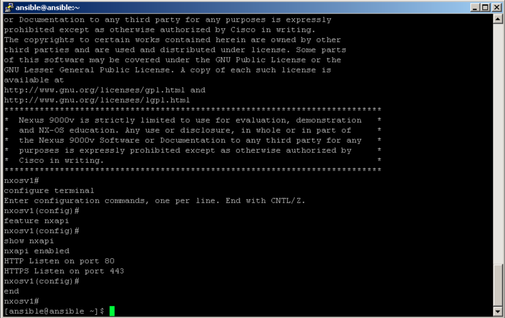


## Automated NXAPI

On Cisco Nexus devices, configuration is performed using command-line interfaces (CLIs) that run only on the device. To improve the accessibility of the Nexus configuration, Cisco introduced NX-API REST by providing HTTP/HTTPS APIs such that:

* Specific CLIs are available outside of the switch.
* Combined configuration actions in relatively few HTTP/HTTPS operations.
* Not only does NX-API REST support commands and switch configurations, it can also run Linux Bash commands.

NX-API REST uses HTTP/HTTPS for transport. Configuration commands are encoded into the HTTP/HTTPS body and use POST as the delivery method. In the backend, NX-API REST uses the Nginx HTTP server. You can instruct the Nginx server to return requested data either in XML or JSON format.


	Note: In order to use NXAPI, make sure that nxapi feature is enabled on the switch.
	
	NXAPI follows a model driven approach. Each model object can be accessed through a unique URL. 
	
	For more information, please refer https://developer.cisco.com/docs/nxapi-dme-model-reference/
	
Step1: We can use a REST API client like Postman to execute the NXAPI calls or wrap them in python script to automate the configuration tasks. In this exercise we’ll be enabling interface-vlan feature on the switch using NXAPI wrapped in a python script. Enter the following command in the ansible putty terminal to view or edit the Python script in VI editor:

```
[ansible@ansible ~]$ vi dc-automation-bootcamp/nxos/lab1/rest/enable_feature_nxapi.py
```

The comments in the script explain what each command does. Go through the script to understand how it works.

```

import requests # used for HTTP requests
import urllib3 # used by HTTP session
import json # used to parse JSON

urllib3.disable_warnings(urllib3.exceptions.InsecureRequestWarning)

# a list of the hosts we wish to access
hosts = ["nxosv1"]

# For each host we wish to connect to
for host in hosts:
    print "\nAuthenticating with the device . . .\n"
    # Get an authentication token for the device
    url = "https://" + host + "/api/mo/aaaLogin.json"
    # Login data
    data = """
    {
      "aaaUser": {
        "attributes": {
          "name": "ansible",
          "pwd": "ansible"
        }
      }
    }
    """
    response = requests.post(url, data=data, headers={'Content-Type': 'application/json'}, verify
=False)
    # uncomment to see the raw JSON
    # print json.dumps(response.json(), indent=2)

    if response.status_code == requests.codes.ok:
        print "Authentication successful!\n"
    else:
        print "Authentication failed! Please verify login credentials!\n"
        exit(0)

    token = response.json()['imdata'][0]['aaaLogin']['attributes']['token']
    print "Authentication Token: " + token + "\n"

    # Enable Interface-Vlan feature on the device
    url = "https://" + host + "/api/mo/sys.json"

    data = """{
      "topSystem": {
        "children": [
          {
            "fmEntity": {
              "children": [
                {
                  "fmInterfaceVlan": {
                    "attributes": {
                      "adminSt": "enabled"
                    }
                  }
                }
              ]
            }
          }
        ]
      }
    }"""

    cookie = {'APIC-Cookie': token}
    response = requests.post(url, cookies=cookie, data=data, headers={'Content-Type': 'application/json'}, verify=False)

    if response.status_code == requests.codes.ok:
        print "Interface-VLAN feature enabled successfully on the device!\n"
    else:
        print "ERROR: Could not enable Interface-VLAN feature!\n"
        exit(0)
```

Step2: Once you have gone through the script, exit the VI editor.

Step3: Run the lab exercise by entering the below command in the putty terminal.

```
[ansible@ansible ~]$ python dc-automation-bootcamp/nxos/lab1/rest/enable_feature_nxapi.py

```

After running, your terminal should look like this:

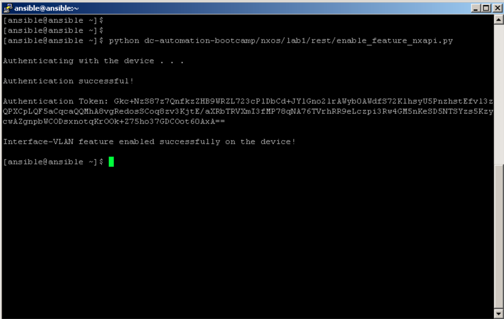


### Output

```
[ansible@ansible ~]$ python dc-automation-bootcamp/nxos/lab1/rest/enable_feature_nxapi.py Authenticating with the device . . .

Authentication successful!

Authentication Token: MtoUYXhIeIYZ5QMbH3SQ96Jv6cJagbB17jVCnoMR+NX4fYoiuXEiGn0jDpj22aGghd7OZe2qreGZ+dGbLVSFldclUdsGMo7OhFCZ71rt l2P10OaZ+FlNKeW+w6mcwzt256HmGwE5VUYGnz+dEo+e/woQjTuO0myrVFe48rQzLOK1s3A3Owfld0iqYgbd/wnG9r4Wz24Cxalwmmnc k15ixw==

Interface-VLAN feature enabled successfully on the device!
```

Step4: In the Python source file, add a block of code to fetch a list of enabled features on the device. We are going to use send a GET request to the device to achieve this. Open the script in the VI editor (refer to step 2) and add the block of code highlighted in red below. Save changes and exit the VI editor. The following 3 lines of code need to be changed.

```
url = "https://" + host + "/api/mo/sys/fm.json?rsp-subtree=children"

response = requests.get(url, cookies=cookie, headers={'Content-Type': 'application/json'}, verify=False)

print json.dumps(response.json(), indent=2)
```

```
	    token = response.json()['imdata'][0]['aaaLogin']['attributes']['token']
	    print "Authentication Token: " + token + "\n"
	
	    # Enable Interface-Vlan feature on the device
	    url = "https://" + host + "/api/mo/sys/fm.json?rsp-subtree=children"
	
	    response = requests.get(url, cookies=cookie, headers={'Content-Type': 'application/json'}, verify=False)
	
	    if response.status_code == requests.codes.ok:
	        print json.dumps(response.json(), indent=2)
	    else:
	        print "ERROR: Could not enable Interface-VLAN feature!\n"
	        exit(0) 
	        
```
           
 

`sys/fm` is the path for feature model object which we would like to ‘GET’ and since each feature is a child of the `sys/fm`, we include `?rsp-subtree=children` in the request so that NXOS includes the children MOs in the response.


Step5: Run the edited script (refer to step 3). You should see the following output:

See if you can identify where the NXAPI feature is shown and how you might determine whether it was enabled or not?


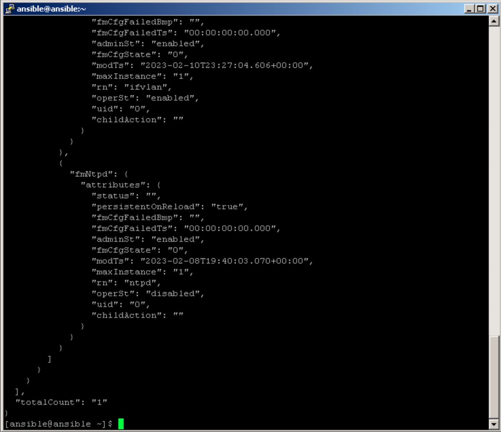

**This concludes Lab 1.**


# Lab 2. Ansible Fundamentals


This module introduces the basics of automating NX-OS with Ansible. Ansible enables the simple automation of tasks across different parts of the infrastructure including compute, storage, and networking. When operating on Cisco NXOS devices Ansible uses the NXAPI, in contrast to its general server operations where it will execute Python code locally on the device under management. This centralised model of operation appeals to large-scale network operators and is one reason for Ansible’s popularity in the Service Provider industry.

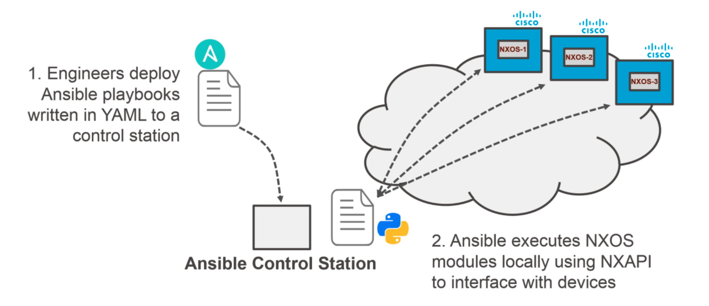


	NOTE: For detailed information regarding each of the NXOS modules, please refer to this link - http://docs.ansible.com/ansible/latest/list_of_network_modules.html#nxos. Each module has a detailed explanation listing all the parameters that the module accepts and also the return values with a few examples.
	

**Inventory files** contain the hosts operated by Ansible. Inventory files contain group and host definitions which may be referenced by Ansible playbooks. Enter the following command to take a look at the inventory file using the VI editor.


```
[ansible@ansible ~]$ vi dc-automation-bootcamp/nxos/lab2/inventory
```

```
nxosv1
[all:vars]
ansible_connection = local
ansible_ssh_user = ansible
ansible_ssh_pass = ansible
```

In this lab exercise we’ll create and execute a simple playbook for creating VLANs using the nxos_vlan module. We’ll be creating:

* Web VLAN – 10
* App VLAN – 20
* DB VLAN – 30

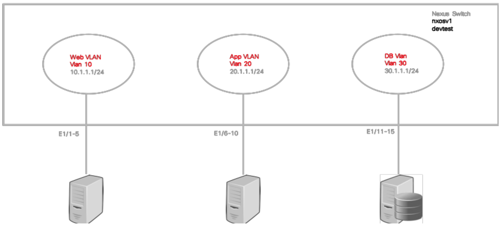

Here, we demonstrate three different ways of passing configuration values to the Ansible tasks – hardcoding the values directly in the task, using variables defined within the playbook and using variables defined in an external file.

Step1: Change to the lab2 directory in the ansible host putty terminal.

```
[ansible@ansible ~]$ cd ~/dc-automation-bootcamp/nxos/lab2/
```

Step2: Enter the following command in the ansible putty terminal to view or edit the ansible playbook in VI editor.

```
[ansible@ansible lab2]$ vi create_vlans.yml
```

The comments in the playbook explain what each section does. Go through the playbook to understand how it works.


	NOTE: Ansible Module used:
	nxos_vlan - http://docs.ansible.com/ansible/latest/nxos_vlan_module.html
	

```
---
- name: VLAN creation Playbook
  hosts: all                        # Execute the tasks on all the hosts defined in the inventory file
  gather_facts: no

  vars:                             # Define variables that will be used in this playbook
    vlan20:
      id: 20
      name: app

  vars_files:                       # Import variables defined in an external file
    - external_vars.yml

  tasks:

  - name: Ensure VLAN 10 exists     # The configuration values are hardcoded in the script
    nxos_vlan:
      vlan_id: 10
      name: web
      transport: nxapi

  - name: Ensure VLAN 20 exists     # The configuration values are defined within the playbook in the vars section
    nxos_vlan:
      vlan_id: "{{ vlan20.id }}"
      name: "{{ vlan20.name }}"
      transport: nxapi

  - name: Ensure VLAN 30 exists     # The configuration values are imported from the external_vars file
    nxos_vlan:
      vlan_id: "{{ vlan30.id }}"
      name: "{{ vlan30.name }}"
      transport: nxapi

```

Step3: Once you have gone through the playbook, exit the VI editor.

Step4: Now, take a look at the external variables file to understand how the variables are defined in an external file. Enter the following command to open the external variables file in VI editor.


```
[ansible@ansible lab2]$ vi external_vars.yml

---

vlan30:
  id: 30
  name: db
```


Step5: Once you have gone through the external variables file, exit the VI editor.

Step6: Run the ansible playbook by entering the below command in the putty terminal.

```
[ansible@ansible lab2]$ ansible-playbook create_vlans.yml -i inventory
```

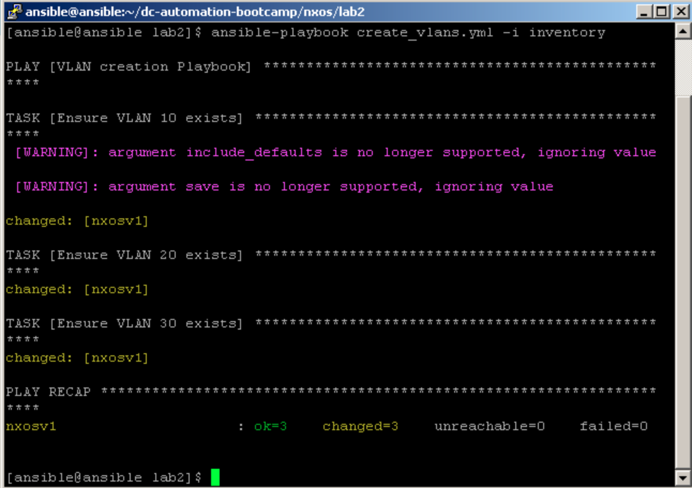

### Output

```
[ansible@ansible lab2]$ ansible-playbook create_vlans.yml -i inventory

PLAY [VLAN creation Playbook] **************************************************

TASK [Ensure VLAN 10 exists] ***************************************************
 [WARNING]: argument include_defaults is no longer supported, ignoring value

 [WARNING]: argument save is no longer supported, ignoring value

changed: [nxosv1]

TASK [Ensure VLAN 20 exists] ***************************************************
changed: [nxosv1]

TASK [Ensure VLAN 30 exists] ***************************************************
changed: [nxosv1]

PLAY RECAP *********************************************************************
nxosv1                     : ok=3    changed=3    unreachable=0    failed=0   

```

Step7: Run the playbook several times (refer to step 6) with –v, -vv, -vvv. Running the playbook with -v option provides more verbal output. You should see more information regarding the background processes that run when you execute the playbook. Adding more ‘v’s provides more verbal output.

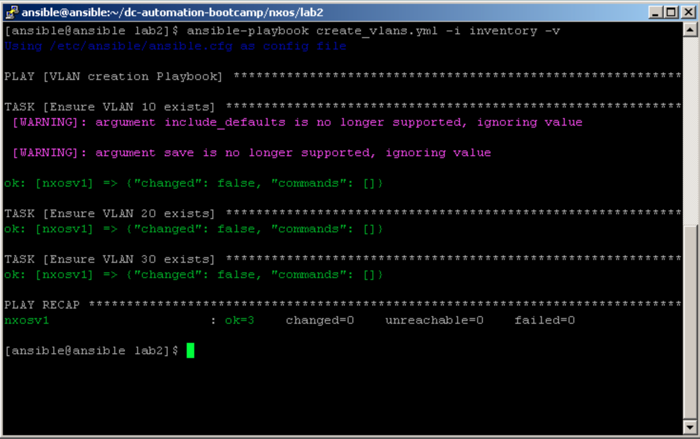


**This concludes Lab 2.**


## Lab 3. Basic Ansible

In this lab exercise we'll learn how to use conditional statements and loops in Ansible. Conditional statements will help in having dCloud: The Cisco Demo Cloud more control on which tasks get executed or how they get executed. Loops will improve the reusability of the automation script by programmatically repeating the execution of tasks over a set of devices or configuration values. Finally, we’ll look at generating formatted output files using templates.

### 3.1 Loops

Let us configure multiple VLAN interfaces. Instead of writing the same task to configure each interface, we’ll use Ansible’s looping statement (with_items) to loop through the same task for multiple interfaces. We’ll be bringing up the VLAN interfaces and configure IPv4 address on each interface.

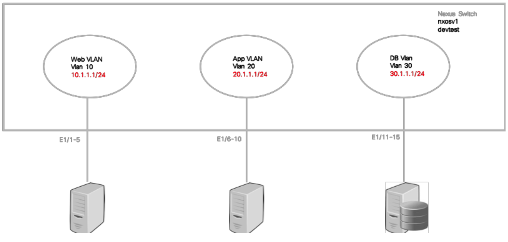


Step1: Change to the 3.1.loops directory in the ansible host putty terminal.

```
[ansible@ansible ~]$ cd ~/dc-automation-bootcamp/nxos/lab3/3.1.loops
```

Step2: Take a look at the external variables file to understand how the variables are defined. Enter the following command to open the external variables file in VI editor.

```
[ansible@ansible 3.1.loops]$ vi external_vars.yml

---

vlan_interfaces:
  - { name: Vlan10, desc: Web VLAN, ipv4: 10.1.1.1, mask: 24 }
  - { name: Vlan20, desc: App VLAN, ipv4: 20.1.1.1, mask: 24 }
  - { name: Vlan30, desc: DB VLAN, ipv4: 30.1.1.1, mask: 24 }

```


All the configuration data for the three VLANs is stored in the variables file. The vlan_interfaces variable contains three items and each item has a name, desc, ipv4 and mask variables defined under it.

Step3: Enter the following command in the ansible putty terminal to view or edit the ansible playbook in VI editor.

```
[ansible@ansible 3.1.loops]$ vi config_vlan_intf.yml
```

The comments in the playbook explain what each section does. Go through the playbook to understand how it works.


	NOTE: Ansible Modules used:
	nxos_interface - http://docs.ansible.com/ansible/latest/nxos_interface_module.html
	nxos_ip_interface - http://docs.ansible.com/ansible/latest/nxos_ip_interface_module.html
	
	
```
---
- name: VLAN Interface Configuration Playbook
  hosts: all
  gather_facts: no
  vars_files:
    - external_vars.yml

  tasks:
  - name: Admin up the VLAN interfaces      # The task will execute for each item defined
 under vlan_interfaces variable
    nxos_interface:
      interface: "{{ item.name }}"
      description: "{{ item.desc }}"
      admin_state: up
      transport: nxapi
    with_items:
      "{{ vlan_interfaces }}"

  - name: IPv4 Address configuration for the VLAN interfaces
    nxos_ip_interface:
      interface: "{{ item.name }}"
      version: v4
      addr: "{{ item.ipv4 }}"
      mask: "{{ item.mask }}"
      transport: nxapi
    with_items:
      "{{ vlan_interfaces }}"    
```

Step4: Once you have gone through the playbook, exit the VI editor.

Step5: Run the ansible playbook by entering the below command in the putty terminal.

```
[ansible@ansible 3.1.loops]$ ansible-playbook config_vlan_intf.yml -i inventory
```

After running, your terminal should look like this:

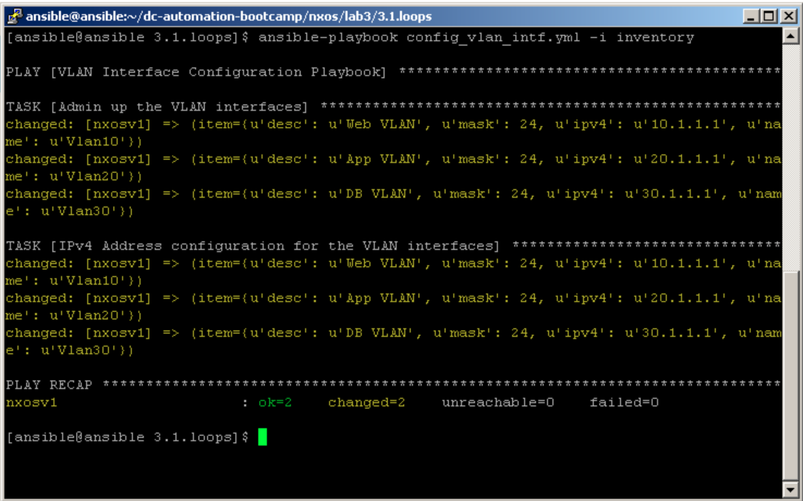

```
[ansible@ansible 3.1.loops]$ ansible-playbook config_vlan_intf.yml -i inventory

PLAY [VLAN Interface Configuration Playbook] ********************************************

TASK [Admin up the VLAN interfaces] *****************************************************
changed: [nxosv1] => (item={u'desc': u'Web VLAN', u'mask': 24, u'ipv4': u'10.1.1.1', u'name': u'Vlan10'})
changed: [nxosv1] => (item={u'desc': u'App VLAN', u'mask': 24, u'ipv4': u'20.1.1.1', u'name': u'Vlan20'})
changed: [nxosv1] => (item={u'desc': u'DB VLAN', u'mask': 24, u'ipv4': u'30.1.1.1', u'name': u'Vlan30'})

TASK [IPv4 Address configuration for the VLAN interfaces] *******************************
changed: [nxosv1] => (item={u'desc': u'Web VLAN', u'mask': 24, u'ipv4': u'10.1.1.1', u'name': u'Vlan10'})
changed: [nxosv1] => (item={u'desc': u'App VLAN', u'mask': 24, u'ipv4': u'20.1.1.1', u'name': u'Vlan20'})
changed: [nxosv1] => (item={u'desc': u'DB VLAN', u'mask': 24, u'ipv4': u'30.1.1.1', u'name': u'Vlan30'})

PLAY RECAP ******************************************************************************
nxosv1                     : ok=2    changed=2    unreachable=0    failed=0
```

### 3.2 Conditionals

In this lab exercise, we’ll look at how to use conditional statements. Conditional statements provide better control over which tasks get executed in a playbook. Conditional statements will be useful especially along with loops.

We’ll be configuring the physical interfaces description based on the VLAN that is associated with it. Interfaces Ethernet1-5 are associated with Web VLAN (10), Ethernet6-10 with App VLAN (20) and Ethernet11-15 with DB VLAN (30).

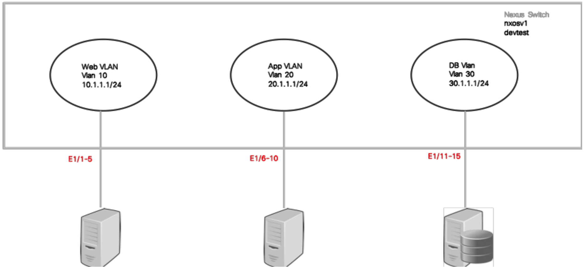


Step1: Change to the 3.2.conditionals directory in the ansible host putty terminal.

```
[ansible@ansible ~]$ cd ~/dc-automation-bootcamp/nxos/lab3/3.2.conditionals
```

Step2: Take a look at the external variables file to understand how the variables are defined. Enter the following command to open the external variables file in VI editor.

```
[ansible@ansible 3.2.conditionals]$ vi external_vars.yml
---

physical_interfaces:
  - { name: Ethernet1/1 , vlan: 10 }
  - { name: Ethernet1/2 , vlan: 10 }
  - { name: Ethernet1/3 , vlan: 10 }
  - { name: Ethernet1/4 , vlan: 10 }
  - { name: Ethernet1/5 , vlan: 10 }
  - { name: Ethernet1/6 , vlan: 20 }
  - { name: Ethernet1/7 , vlan: 20 }
  - { name: Ethernet1/8 , vlan: 20 }
  - { name: Ethernet1/9 , vlan: 20 }
  - { name: Ethernet1/10 , vlan: 20 }
  - { name: Ethernet1/11 , vlan: 30 }
  - { name: Ethernet1/12 , vlan: 30 }
  - { name: Ethernet1/13 , vlan: 30 }
  - { name: Ethernet1/14 , vlan: 30 }
  - { name: Ethernet1/15 , vlan: 30 }
```

We’ll write a playbook with tasks for setting the interface description as either Web Vlan or App Vlan or DB Vlan depending on the VLAN that has been defined for the interface in the variables file. For example, the task for configuring the web interfaces, checks if vlan variable of each physical interface is 10.

Step3: Enter the following command in the ansible putty terminal to view or edit the ansible playbook in VI editor.

```
[ansible@ansible 3.2.conditionals]$ vi set_interface_descr.yml
```

The comments in the playbook explain what each section does. Go through the playbook to understand how it works.

	NOTE: Ansible Module used:
	nxos_interface - http://docs.ansible.com/ansible/latest/nxos_interface_module.html
	


```
---
- name: Playbook for setting interface descriptions
  hosts: all
  gather_facts: no
  vars_files:
    - external_vars.yml

  tasks:
  - name: Set the physical ports descriptions for Web interfaces
    nxos_interface:
      interface: "{{ item.name }}"
      description: Web Vlan
      transport: nxapi
    with_items:                       # This task will execute for each item defined under physical_interfaces variable
      "{{ physical_interfaces }}"     # only when the vlan value of each item defined is 10.
    when:
      - item.vlan == 10

  - name: Set the physical ports descriptions for App interfaces
    nxos_interface:
      interface: "{{ item.name }}"
      description: App Vlan
      transport: nxapi
    with_items:
      "{{ physical_interfaces }}"
    when:
      - item.vlan == 20

  - name: Set the physical ports descriptions for DB interfaces
    nxos_interface:
      interface: "{{ item.name }}"
      description: DB Vlan
      transport: nxapi
    with_items:
      "{{ physical_interfaces }}"
    when:
      - item.vlan == 30

```

Step4: Once you have gone through the playbook, exit the VI editor.

Step5: Run the ansible playbook by entering the below command in the putty terminal.

```
[ansible@ansible 3.2.conditionals]$ ansible-playbook set_interface_descr.yml -i inventory
```

After running, your terminal should look like this:

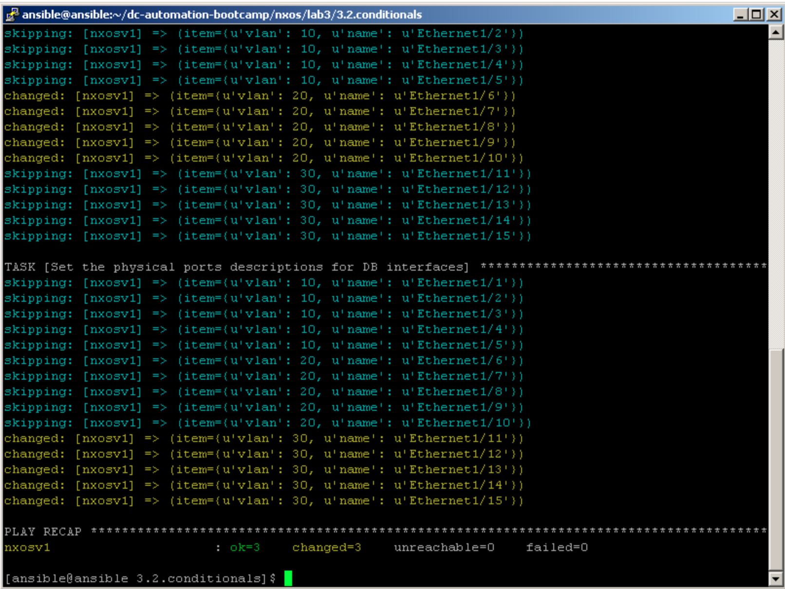

### Output

```
[ansible@ansible 3.2.conditionals]$ ansible-playbook set_interface_descr.yml -i inventory         
PLAY [Playbook for setting interface descriptions] ***********************************************

TASK [Set the physical ports descriptions for Web interfaces] ************************************
changed: [nxosv1] => (item={u'vlan': 10, u'name': u'Ethernet1/1'})
changed: [nxosv1] => (item={u'vlan': 10, u'name': u'Ethernet1/2'})
changed: [nxosv1] => (item={u'vlan': 10, u'name': u'Ethernet1/3'})
changed: [nxosv1] => (item={u'vlan': 10, u'name': u'Ethernet1/4'})
changed: [nxosv1] => (item={u'vlan': 10, u'name': u'Ethernet1/5'})
skipping: [nxosv1] => (item={u'vlan': 20, u'name': u'Ethernet1/6'})
skipping: [nxosv1] => (item={u'vlan': 20, u'name': u'Ethernet1/7'})
skipping: [nxosv1] => (item={u'vlan': 20, u'name': u'Ethernet1/8'})
skipping: [nxosv1] => (item={u'vlan': 20, u'name': u'Ethernet1/9'})
skipping: [nxosv1] => (item={u'vlan': 20, u'name': u'Ethernet1/10'})
skipping: [nxosv1] => (item={u'vlan': 30, u'name': u'Ethernet1/11'})
skipping: [nxosv1] => (item={u'vlan': 30, u'name': u'Ethernet1/12'})
skipping: [nxosv1] => (item={u'vlan': 30, u'name': u'Ethernet1/13'})
skipping: [nxosv1] => (item={u'vlan': 30, u'name': u'Ethernet1/14'})
skipping: [nxosv1] => (item={u'vlan': 30, u'name': u'Ethernet1/15'})

TASK [Set the physical ports descriptions for App interfaces] ************************************
skipping: [nxosv1] => (item={u'vlan': 10, u'name': u'Ethernet1/1'})
skipping: [nxosv1] => (item={u'vlan': 10, u'name': u'Ethernet1/2'})
skipping: [nxosv1] => (item={u'vlan': 10, u'name': u'Ethernet1/3'})
skipping: [nxosv1] => (item={u'vlan': 10, u'name': u'Ethernet1/4'})
skipping: [nxosv1] => (item={u'vlan': 10, u'name': u'Ethernet1/5'})
changed: [nxosv1] => (item={u'vlan': 20, u'name': u'Ethernet1/6'})
changed: [nxosv1] => (item={u'vlan': 20, u'name': u'Ethernet1/7'})
changed: [nxosv1] => (item={u'vlan': 20, u'name': u'Ethernet1/8'})
changed: [nxosv1] => (item={u'vlan': 20, u'name': u'Ethernet1/9'})
changed: [nxosv1] => (item={u'vlan': 20, u'name': u'Ethernet1/10'})
skipping: [nxosv1] => (item={u'vlan': 30, u'name': u'Ethernet1/11'})
skipping: [nxosv1] => (item={u'vlan': 30, u'name': u'Ethernet1/12'})
skipping: [nxosv1] => (item={u'vlan': 30, u'name': u'Ethernet1/13'})
skipping: [nxosv1] => (item={u'vlan': 30, u'name': u'Ethernet1/14'})
skipping: [nxosv1] => (item={u'vlan': 30, u'name': u'Ethernet1/15'})

TASK [Set the physical ports descriptions for DB interfaces] *************************************
skipping: [nxosv1] => (item={u'vlan': 10, u'name': u'Ethernet1/1'})
skipping: [nxosv1] => (item={u'vlan': 10, u'name': u'Ethernet1/2'})
skipping: [nxosv1] => (item={u'vlan': 10, u'name': u'Ethernet1/3'})
skipping: [nxosv1] => (item={u'vlan': 10, u'name': u'Ethernet1/4'})
skipping: [nxosv1] => (item={u'vlan': 10, u'name': u'Ethernet1/5'})
skipping: [nxosv1] => (item={u'vlan': 20, u'name': u'Ethernet1/6'})
skipping: [nxosv1] => (item={u'vlan': 20, u'name': u'Ethernet1/7'})
skipping: [nxosv1] => (item={u'vlan': 20, u'name': u'Ethernet1/8'})
skipping: [nxosv1] => (item={u'vlan': 20, u'name': u'Ethernet1/9'})
skipping: [nxosv1] => (item={u'vlan': 20, u'name': u'Ethernet1/10'})
changed: [nxosv1] => (item={u'vlan': 30, u'name': u'Ethernet1/11'})
changed: [nxosv1] => (item={u'vlan': 30, u'name': u'Ethernet1/12'})
changed: [nxosv1] => (item={u'vlan': 30, u'name': u'Ethernet1/13'})
changed: [nxosv1] => (item={u'vlan': 30, u'name': u'Ethernet1/14'})
changed: [nxosv1] => (item={u'vlan': 30, u'name': u'Ethernet1/15'})

PLAY RECAP ***************************************************************************************
nxosv1                     : ok=3    changed=3    unreachable=0    failed=0

```

## 3.3 Templates

In this lab exercise, we will explore how to obtain, store and manipulate the output from our Ansible Playbooks. Firstly, we will look at how to register variables in Playbooks, and write this output to files on disk.

### JSON output


In the first exercise, we use a new simple Playbook and a new Ansible NXOS module as a foundation to register a variable, and copy its contents to a file. We will execute a show command on device nxosv1 to list the available, enabled, and disabled, features.

We will explore the nxos_command module in the next exercise. In this exercise, please pay attention to the way in which a task’s output is registered, and how we use a task called `local_action` to `copy` the returned content.

Step1: Change to the 3.3.templates directory in the ansible host putty terminal.

```
[ansible@ansible ~]$ cd ~/dc-automation-bootcamp/nxos/lab3/3.3.templates
```

Step2: Enter the following command in the ansible putty terminal to view or edit the ansible playbook in VI editor.

```
[ansible@ansible 3.3.templates]$ vi interface_json.yml
```

The comments in the playbook explain what each section does. Go through the playbook to understand how it works.


	NOTE: Ansible Module used:
	
	nxos_command - http://docs.ansible.com/ansible/latest/nxos_command_module.html

	local_action – this is a short hand syntax for executing a task on the local machine where the ansible playbook is being run from, instead of the target device. Refer to this link for more information about local_action - http://docs.ansible.com/ansible/latest/playbooks_delegation.html#delegation


```
---
- name: Playbook for getting the Vlan10 interface details in the JSON format
  hosts: all
  gather_facts: no

  tasks:
  - name: Get interface details         # Fetch Vlan10 interface details and store it in interface_facts variable
    nxos_command:
      commands: "show ip interface Vlan10"
      transport: nxapi
    register: interface_facts

  # Copy the contents of the interface_facts variable into a json file
  - local_action: copy content={{ interface_facts }} dest=./intf-{{inventory_hostname}}.json
```

Step3: Once you have gone through the playbook, exit the VI editor.

Step4: Run the ansible playbook by entering the below command in the putty terminal.

```
[ansible@ansible 3.3.templates]$ ansible-playbook interface_json.yml -i inventory
```

After running, your terminal should look like this:

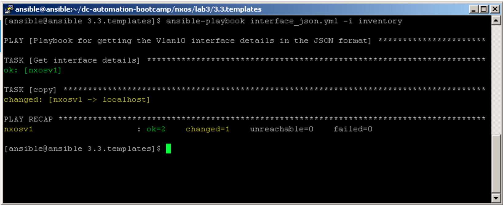

### Output

```
[ansible@ansible 3.3.templates]$ ansible-playbook interface_json.yml -i inventory

PLAY [Playbook for getting the Vlan10 interface details in the JSON format] **********************

TASK [Get interface details] *********************************************************************
ok: [nxosv1]

TASK [copy] **************************************************************************************
changed: [nxosv1 -> localhost]

PLAY RECAP ***************************************************************************************
nxosv1                     : ok=2    changed=1    unreachable=0    failed=0

[ansible@ansible 3.3.templates]$
```

### Output JSON file

Enter the following command to view the output file containing the data fetched from the device:

```
[ansible@ansible 3.3.templates]$ cat intf-nxosv1.json
```


```
{"failed": false, "changed": false, "stdout": [{"TABLE_vrf": {"ROW_vrf": {"vrf-name-out": "default"}}, "TABLE_intf": {"ROW_intf": {"upkt-orig": 0, "num-maddr": 0, "lbyte-recv": 0, "mpkt-consumed": 0, "proxy-arp": "disabled", "stats-last-reset": "never", "upkt-recv": 0, "proto-state": "down", "upkt-consumed": 0, "bpkt-recv": 0, "prefix": "10.1.1.1", "tag": 0, "mpkt-fwd": 0, "num-addr": 1, "bbyte-consumed": 0, "ip-disabled": "FALSE", "admin-state": "up", "upkt-fwd": 0, "subnet": "10.1.1.0", "lbyte-fwd": 0, "bbyte-fwd": 0, "mbyte-sent": 0, "pref": 0, "bbyte-sent": 0, "bpkt-consumed": 0, "intf-name": "Vlan10", "ubyte-fwd": 0, "lbyte-sent": 0, "upkt-sent": 0, "mpkt-recv": 0, "mbyte-orig": 0, "ubyte-consumed": 0, "mrouting": "disabled", "bbyte-recv": 0, "port-unreach": "enabled", "ubyte-orig": 0, "link-state": "down", "lcl-proxy-arp": "disabled", "mbyte-consumed": 0, "lpkt-sent": 0, "urpf-mode": "none", "bbyte-orig": 0, "masklen": 24, "ip-ls-type": "none", "lbyte-consumed": 0, "ubyte-sent": 0, "bpkt-orig": 0, "bpkt-fwd": 0, "mbyte-recv": 0, "iod": 72, "lpkt-consumed": 0, "lpkt-fwd": 0, "dir-bcast": "disabled", "ubyte-recv": 0, "lpkt-orig": 0, "lpkt-recv": 0, "mpkt-orig": 0, "mpkt-sent": 0, "mtu": 1500, "bpkt-sent": 0, "icmp-redirect": "enabled", "lbyte-orig": 0, "ip-unreach": 0, "mbyte-fwd": 0, "bcast-addr": "255.255.255.255"}}}], "stdout_lines": [{"TABLE_vrf": {"ROW_vrf": {"vrf-name-out": "default"}}, "TABLE_intf": {"ROW_intf": {"upkt-orig": 0, "num-maddr": 0, "lbyte-recv": 0, "mpkt-consumed": 0, "proxy-arp": "disabled", "stats-last-reset": "never", "upkt-recv": 0, "proto-state": "down", "upkt-consumed": 0, "bpkt-recv": 0, "prefix": "10.1.1.1", "tag": 0, "mpkt-fwd": 0, "num-addr": 1, "bbyte-consumed": 0, "ip-disabled": "FALSE", "admin-state": "up", "upkt-fwd": 0, "subnet": "10.1.1.0", "lbyte-fwd": 0, "bbyte-fwd": 0, "mbyte-sent": 0, "pref": 0, "bbyte-sent": 0, "bpkt-consumed": 0, "intf-name": "Vlan10", "ubyte-fwd": 0, "lbyte-sent": 0, "upkt-sent": 0, "mpkt-recv": 0, "mbyte-orig": 0, "ubyte-consumed": 0, "mrouting": "disabled", "bbyte-recv": 0, "port-unreach": "enabled", "ubyte-orig": 0, "link-state": "down", "lcl-proxy-arp": "disabled", "mbyte-consumed": 0, "lpkt-sent": 0, "urpf-mode": "none", "bbyte-orig": 0, "masklen": 24, "ip-ls-type": "none", "lbyte-consumed": 0, "ubyte-sent": 0, "bpkt-orig": 0, "bpkt-fwd": 0, "mbyte-recv": 0, "iod": 72, "lpkt-consumed": 0, "lpkt-fwd": 0, "dir-bcast": "disabled", "ubyte-recv": 0, "lpkt-orig": 0, "lpkt-recv": 0, "mpkt-orig": 0, "mpkt-sent": 0, "mtu": 1500, "bpkt-sent": 0, "icmp-redirect": "enabled", "lbyte-orig": 0, "ip-unreach": 0, "mbyte-fwd": 0, "bcast-addr": "255.255.255.255"}}}]}
```

	NOTE: We are going to use the highlighted variables in the above output in our next lab exercise and task.
	
### Template-based output

Ansible Templates can be used to provide additional formatting and manipulate of the Playbook output. Ansible uses the Jinja2 templating language. More information on Jinja2 can be found at: http://jinja.pocoo.org/docs/dev/


Step1: We will use a very basic Jinja2 template to enhance the output of our Playbook from the previous playbook. Take a look at the template file to understand how it is defined. Enter the following command to open the template file in VI editor


```
[ansible@ansible 3.3.templates]$ vi intf_template.j2
Interface Details:

---------------------------------------------
| Interface  |  Prefix  |  Subnet  |  Mask  |
---------------------------------------------
|   {{ interface }}   | {{ fmt_int.prefix }} | {{ fmt_int.subnet }} |   {{ fmt_int.masklen }}   |
---------------------------------------------
```

Step2: Enter the following command in the ansible putty terminal to view or edit the ansible playbook in VI editor.

```
[ansible@ansible 3.3.templates]$ vi interface_template.yml
```

The comments in the playbook explain what each section does. Go through the playbook to understand how it works.


	NOTE: Ansible Module used:
	
	nxos_command - http://docs.ansible.com/ansible/latest/nxos_command_module.html
		
	set_fact – http://docs.ansible.com/ansible/latest/set_fact_module.html
	
	template - http://docs.ansible.com/ansible/latest/template_module.html


```
---
- name: Interface Configuration Playbook
  hosts: all
  gather_facts: no
  vars:
    interface: Vlan10

  tasks:
  - name: Get interface details         # Fetch Vlan10 interface details and store it in interface_facts variable
    nxos_command:
      commands: "show ip interface {{ interface }}"
      transport: nxapi
    register: interface_facts

  # Parse through the JSON and store only the interface related information in fmt_int variable
  - set_fact: fmt_int="{{ interface_facts.stdout[0].TABLE_intf.ROW_intf }}"

  # Create a new file using the intf_template.j2 template and substituting the variable values
  - template: src=./intf_template.j2 dest=./intf-{{inventory_hostname}}.txt
```

Step3: Once you have gone through the playbook, exit the VI editor.

Step4: Run the ansible playbook by entering the below command in the putty terminal.

```
[ansible@ansible 3.3.templates]$ ansible-playbook interface_template.yml -i inventory
```

After running, your terminal should look like this:

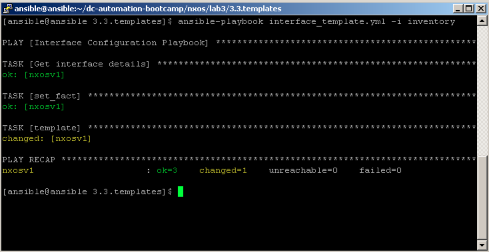


### Output

```
[ansible@ansible 3.3.templates]$ ansible-playbook interface_template.yml -i inventory

PLAY [Interface Configuration Playbook] *************************************************

TASK [Get interface details] ************************************************************
ok: [nxosv1]

TASK [set_fact] *************************************************************************
ok: [nxosv1]

TASK [template] *************************************************************************
changed: [nxosv1]

PLAY RECAP ******************************************************************************
nxosv1                     : ok=3    changed=1    unreachable=0    failed=0

```


### Output file

Enter the following command to view the output file containing the data fetched from the device. Notice how using templates, we have a much more readable output file.

```
[ansible@ansible 3.3.templates]$ cat intf-nxosv1.txt
Interface Details:

---------------------------------------------
| Interface  |  Prefix  |  Subnet  |  Mask  |
---------------------------------------------
|   Vlan10   | 10.1.1.1 | 10.1.1.0 |   24   |
---------------------------------------------

```

**This concludes Lab 3.**


## Lab 4. Advanced Ansible

Within a datacenter, some of the configuration values will be common for many devices. Hence, by grouping the devices according to suitable criteria (functionality, geographical etc.,) the automation becomes more logically organized and efficient. In the first section, we’ll look at how defining host groups will help in writing more efficient playbooks. And, in the second section we’ll look at the concept of Roles in Ansible. By defining roles for host groups, we can organize our playbooks more logically, which in turn makes them easily scalable.


### 4.1 Groups

Step1: Change to the 4.1.groups directory in the ansible host putty terminal.

```
[ansible@ansible ~]$ cd ~/dc-automation-bootcamp/nxos/lab4/4.1.groups
```


Step2: Take a look at the inventory file to understand how the hosts and groups are defined. Enter the following command to open the external variables file in VI editor.


```
[ansible@ansible 4.1.groups]$ vi inventory
nxosv1
nxosv2

[devtest]
nxosv1

[production]
nxosv2

[all:vars]
ansible_connection = local
ansible_ssh_user = ansible
ansible_ssh_pass = ansible
```

We have defined two groups - devtest and production. And, each of these groups consists of a host. Defining host groups in Ansible helps in defining group level variables, i.e., configuration values which are common across all devices in a group. Also, groups give more control over what tasks to execute for a set of hosts.


Step3: Enter the following command in the ansible putty terminal to view or edit the ansible playbook in VI editor.

```
[ansible@ansible 4.1.groups]$ vi main.yml
```

The comments in the playbook explain what each section does. Go through the playbook to understand how it works.


	NOTE: Ansible Module used:
	
	nxos_system - http://docs.ansible.com/ansible/latest/nxos_system_module.html
	 
	nxos_feature – http://docs.ansible.com/ansible/latest/nxos_feature_module.html


```
---
- name: Configuration Playbook using Groups
  hosts: all
  gather_facts: no

  # Note that no variable files are explicitly imported. Ansible will import the variables automatically, when defined
  # in the standard directory structure.
  # If the same variable is defined in both host_vars and group_vars, host_vars will have higher precedence and hence
  # will be used in the tasks.

  tasks:
  - name: configure hostname        # The variable is imported from the host_vars directory
    nxos_system:
      hostname: "{{ hostname }}"
      transport: nxapi

  - name: Enable features           # The variable is imported from the group_vars directory
    nxos_feature:
      feature: "{{ item }}"
      state: enabled
      transport: nxapi
    with_items:
      "{{ features }}"
```

Step4: Once you have gone through the playbook, exit the VI editor.

Step5: Now, take a look at the group variable files under the `group_vars` directory using the VI editor.


```
[ansible@ansible 4.1.groups]$ vi group_vars/devtest.yml
---

features:
 - interface-vlan
```

```
[ansible@ansible 4.1.groups]$ vi group_vars/production.yml
---

features:
 - interface-vlan
 - private-vlan
```

Step6: Now, take a look at the host variable files under the host_vars directory using the VI editor.

```
[ansible@ansible 4.1.groups]$ vi host_vars/nxosv1.yml
---

hostname: nxosv1
```


```
[ansible@ansible 4.1.groups]$ vi host_vars/nxosv2.yml
---

hostname: nxosv2
```

Step7: Run the ansible playbook by entering the below command in the putty terminal.

```
[ansible@ansible 4.1.groups]$ ansible-playbook main.yml -i inventory
```
After running, your terminal should look like this:

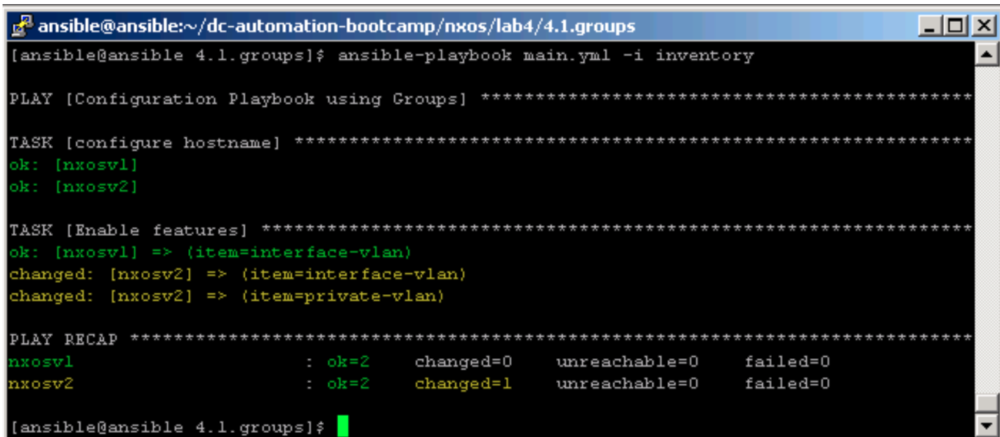


### Output

```
[ansible@ansible 4.1.groups]$ ansible-playbook main.yml -i inventory

PLAY [Configuration Playbook using Groups] **********************************************

TASK [configure hostname] ***************************************************************
ok: [nxosv1]
ok: [nxosv2]

TASK [Enable features] ******************************************************************
ok: [nxosv1] => (item=interface-vlan)
changed: [nxosv2] => (item=interface-vlan) 
changed: [nxosv2] => (item=private-vlan)

PLAY RECAP ******************************************************************************
nxosv1                     : ok=2    changed=0    unreachable=0    failed=0
nxosv2                     : ok=2    changed=1    unreachable=0    failed=0

```

### 4.2 Roles


When there is large number of ansible tasks to be executed on the hosts, roles are the best way to organize them. Hosts, in our case switches, can be logically assigned specific roles depending on the host functionality and configuration requirements.

The most important contents of a role are the tasks and vars. Any number of roles can be imported into a playbook. When a role is imported, all the tasks and variables defined for that role are automatically loaded. Grouping content by roles also allows easy sharing of roles with other users.

The inventory file remains same as in the previous exercise with production and devtest groups.

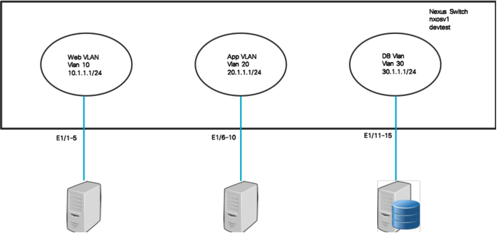


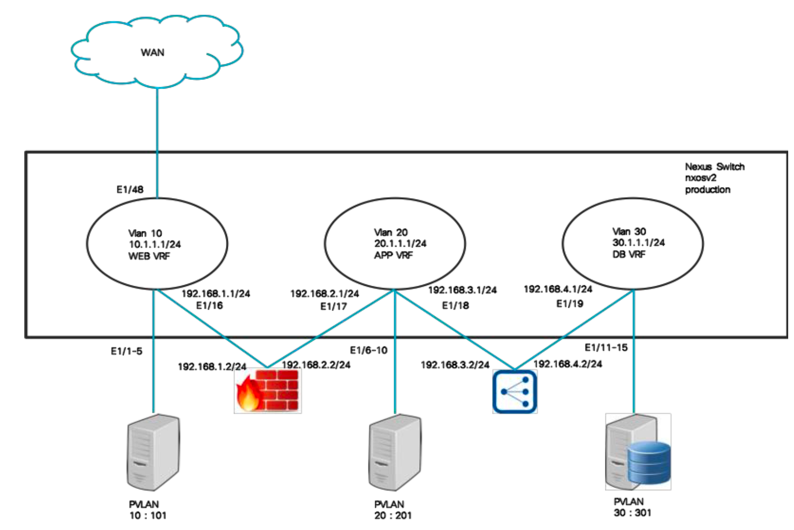


Step1: Change to the 4.2.roles directory in the ansible host putty terminal.

```
[ansible@ansible ~]$ cd ~/dc-automation-bootcamp/nxos/lab4/4.2.roles
```

Step2: We’ll be creating three roles – production, devtest and common. Once we have the required directories and files for the roles created, we’ll be importing the roles in the playbooks. Note that, we can control in the playbook which role gets assigned to which group of hosts. Take a look at the devtest playbook to understand how this is done:


```
[ansible@ansible 4.2.roles]$ vi devtest.yml
---
- name: Config playbook for devtest environment
  hosts: devtest          # Run the playbook for only the devtest devices
  connection: local
  gather_facts: no
  roles:
  - devtest
```

Step3: The common playbook will contain the configuration which is applicable to both production and staging hosts. Take a look at the common playbook and notice the ‘:’ (or) operator used to include both the devtest and production devices for this playbook.


```
[ansible@ansible 4.2.roles]$ vi common.yml
---
- name: Config playbook for both production and devtest environment
  hosts: devtest:production     # Run the playbook for both devtest and production devices
  connection: local
  gather_facts: no
  roles:
  - common
```

Step4: There’s a directory for each role inside a ‘roles’ directory. Within each role’s directory, there are directories for tasks, variables, handlers. Take a look at the tasks and vars yaml files for ‘devtest’ role.

```
[ansible@ansible 4.2.roles]$ vi roles/devtest/tasks/main.yml
---

- name: Set the switchport trunk allowed vlan on all physical interfaces
  nxos_switchport:
    interface: "{{ item.name }}"
    mode: trunk
    trunk_allowed_vlans: "1-4094"
    transport: nxapi
  with_items:
    "{{ physical_interfaces }}"

- name: Set the switchport access vlan
  nxos_switchport:
    interface: "{{ item.name }}"
    mode: access
    access_vlan: "{{ item.vlan }}"
    transport: nxapi
  with_items:
    "{{ physical_interfaces }}"

- name: IPv4 Address configuration for the VLAN interfaces
  nxos_ip_interface:
    interface: "{{ item.name }}"
    version: v4
    addr: "{{ item.ipv4 }}"
    mask: 24
    transport: nxapi
  with_items:
    "{{ vlan_interfaces }}"
```


```
[ansible@ansible 4.2.roles]$ vi roles/devtest/vars/main.yml
---

vlan_interfaces:
  - { name: Vlan10, ipv4: 10.1.1.1, mask: 24 }
  - { name: Vlan20, ipv4: 20.1.1.1, mask: 24 }
  - { name: Vlan30, ipv4: 30.1.1.1, mask: 24 }
```


	NOTE: The main.yml file within each task can be further split into smaller playbooks. The main.yml playbook within the production task imports another playbook called private_vlan.yml present in the same directory. The private_vlan.yml playbook contains all the tasks related to private vlan configuration. 
	Since, the NXOS module for private_vlan is still under development and is not yet available in the official Ansible releases, we use the generic nxos_config module for private vlan configuration.
	

Step5: Enter the following command in the ansible putty terminal to view or edit the main ansible playbook in VI editor.

```
[ansible@ansible 4.2.roles]$ vi main.yml
---
- name: Config playbook for both production and devtest environment
  hosts: devtest:production
  connection: local
  gather_facts: no

- import_playbook: common.yml
- import_playbook: production.yml
- import_playbook: devtest.yml
```

Step6: Run the ansible playbook by entering the below command in the putty terminal.

```
[ansible@ansible 4.2.roles]$ ansible-playbook main.yml -i inventory
```

After running, your terminal should look like this:


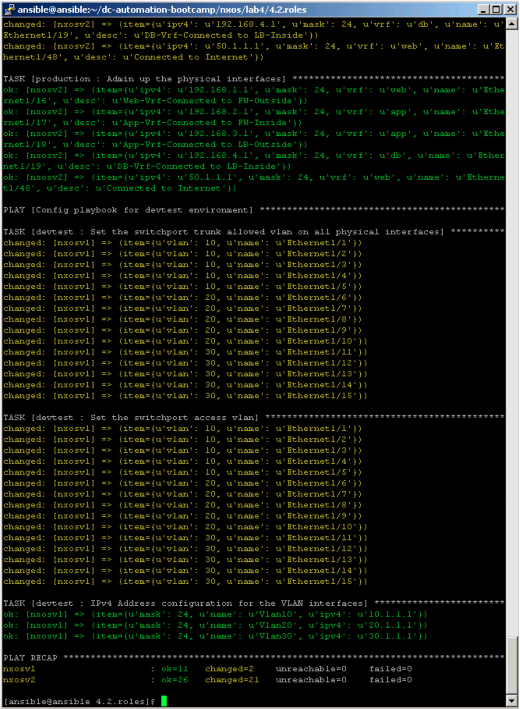


### Output

```
[ansible@ansible 4.2.roles]$ ansible-playbook main.yml -i inventory

PLAY [Config playbook for both production and devtest environment] *************************************
PLAY [Config playbook for both production and devtest environment] ************************************* : 
TASK [common :Enable features] ************************************************************************
ok: [nxosv2]
ok: [nxosv1]
.
.
.
.
.
.
.
.
.
.
.
.
.

PLAY RECAP ******************************************************************************
nxosv1                     : ok=11   changed=2    unreachable=0    failed=0
nxosv2                     : ok=26   changed=21   unreachable=0    failed=0
```

**This concludes Lab 4.**
