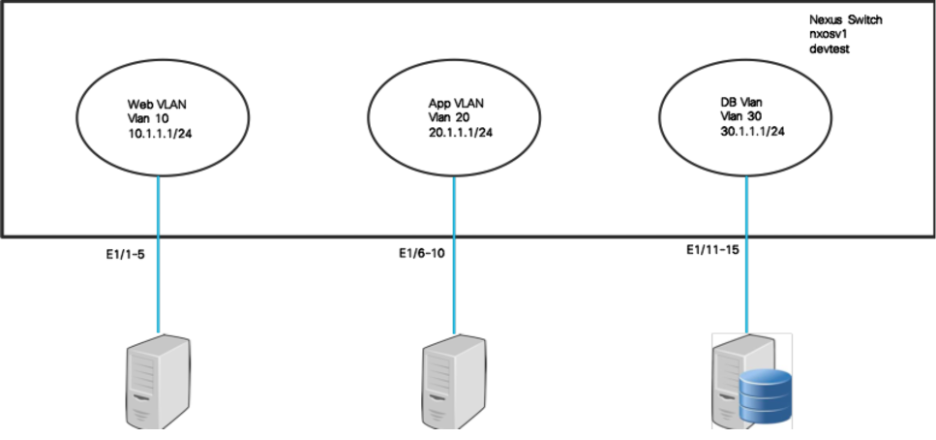
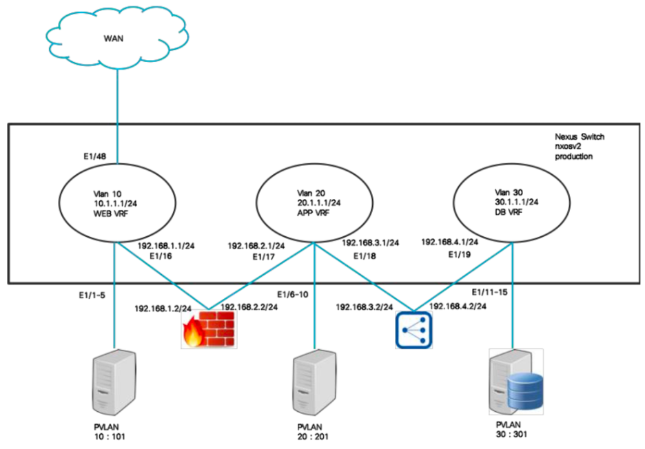

# Welcome to Cisco Datacenter NXOS Automation with Ansible

## About This Lab

This document is for the preconfigured Cisco Data Center NXOS Automation with Ansible includes:

* About This Lab
* Requirements
* About The Lab Exercises
* Topology
* Get Started
* NXOS Automation
   * Lab 1. Automation using Python
   		* AutomatedCLI
   		* AutomatedNXAPI  
	* Lab 2. Ansible Fundamentals  
   * Lab 3. Basic Ansible
   		* 3.1 Loops
   		* 3.2Conditionals
   		* 3.3Templates
   * Lab 4. Advanced Ansible
   		* 4.1Groups
   		* 4.2Roles
   * Troubleshooting

    
## Requirements

* Login to Cisco dCloud
* Laptop
* Cisco AnyConnect (Optional)

## Components
* Cisco VIRL
* NXOSv 7.0 (3) I7(1)
* Ansible host - CentOS 7
* PC Workstation at 198.18.133.252:
	* Includes PuTTY with shortcut for Ansible host, NXOSv1, and NXOSv2
	* Chrome with tabs open for Launch Control Center and Live Visualization Engine

## Features
### Cisco VIRL
* Virtual environment for building network topologies
* Simulation of networking components
* Capable of running a range of virtual machines (VMs) running Cisco operating systems (IOS-XE, IOS Classic, IOS-XR, and NX-OS)
* Support for third-party VMs
* Capture and analyze network traffic at any node
* Validate configurations prior to physical deployment

### NXOS
* NXOS is open and modular
* NX-OS supports built-in DevOps automation tools like Puppet, Chef, and Ansible, and native and industry standard YANG models
* NXOS application hosting supports third-party off-the-shelf applications
* Programmable NXOS enables integration with orchestration tools

## About these Lab Exercises

This document provides a step-by-step guide to learning how to automate Cisco NXOS using the Open Source Ansible automation technology [Ansible](http://ansible.com). It uses virtualised instances of Linux and NXOS in order to provide an environment for lab task execution and experimentation.

Ansible enables the simple automation of tasks across different parts of the infrastructure including compute, storage, and networking. When operating on Cisco NXOS devices Ansible uses the NXAPI, in contrast to its general server operations where it will execute Python code locally on the device under management. This centralized model of operation appeals to large-scale network operators and is one reason for Ansible’s popularity in the Service Provider industry.

In the exercises you will be configuring two virtual NXOS devices – nxosv1 and nxosv2. For our scenarios, we consider nxosv1 a devtest device, and nxosv2 a production device. This will help us in highlighting numerous advanced capabilities of Ansible. Through the NXOS lab exercises, we will configure and manipulate numerous private and public VLANs, IP interfaces, IP route tables, and VRFs. In ACI, we will configure tenants, bridge domains, VRFs, Contracts, Endpoint Groups and Application Profiles.

You will begin with simple configuration of the devtest device, using basic VLANs and IP interfaces. This allows us to introduce the fundamental features and structure of Ansible with use cases which most networking professionals would be familiar with.

In later NXOS lab exercises we highlight ways in which we can build on common configurations to customise and extend for specific network infrastructure roles. For example, on the production devices you can add the following for better security.

* Create VRFs namely Web, App, DB and stitch them using FW and Load balancers.
* Create IP Access List for Web VLAN
* Create required static routes to ensure traffic goes through a firewall and load balancer.
* To ensure security within each VRF we will use private VLANs.

